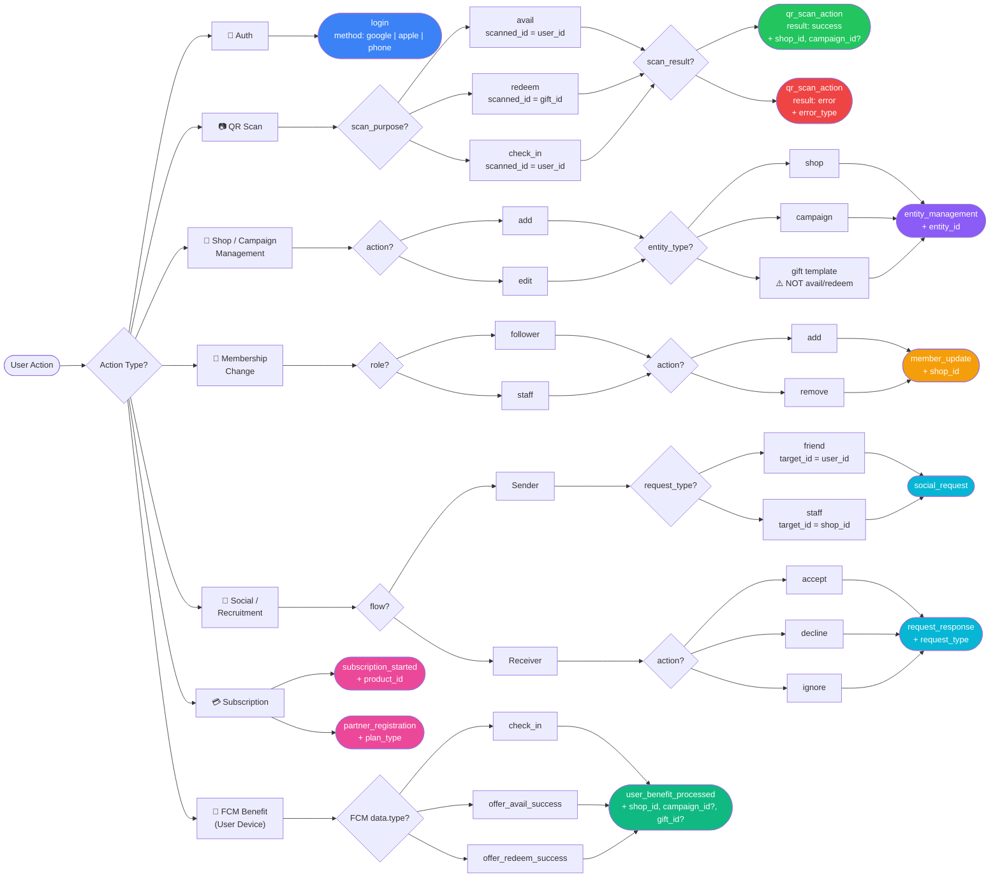

# Proposal: Google Analytics (GA4) Event Taxonomy

---

## 1. Executive Summary

The goal of this implementation is to move beyond basic page views and transition into **Event-Driven Analytics**. By utilizing a "Type + Parameter" structure, we will track the core app lifecycle—Scanning, Shop Management, Staffing, and Social Growth—without creating "Event Bloat."

---

## 2. Core Feature: Scanning Logic

Since "Scanning" is the primary method for three different business goals, we use a **single unified event** to measure success rates and feature popularity across all scan types.

### Event: `qr_scan_action`

| **Parameter** | **Description** | **Values** | **Required** |
| --- | --- | --- | --- |
| `scan_purpose` | The intent of the scan. | `avail`, `redeem`, `check_in` | ✅ Always |
| `scan_result` | Outcome of the action. | `success`, `error` | ✅ Always |
| `scanned_id` | The ID encoded in the QR code. Type depends on `scan_purpose` (see table below). | `{user_id}` or `{gift_id}` | ✅ Always |
| `shop_id` | The shop in which the scan occurred. | `{shop_id}` | ✅ Always |
| `campaign_id` | The campaign the gift belongs to (avail/redeem only). | `{campaign_id}` | ⬜ When applicable |
| `error_type` | Debugging code, only present when `scan_result = error`. | `invalid_code`, `timeout`, `expired` | ⬜ On error only |

#### `scanned_id` meaning by purpose

| `scan_purpose` | QR data | `scanned_id` value |
| --- | --- | --- |
| `avail` | User's QR code | `user_id` of the customer |
| `redeem` | Gift QR code | `gift_id` of the availed gift |
| `check_in` | User's QR code | `user_id` of the customer |

> **Business Value:** This allows us to see if specific features (like "Redeem") have a higher failure rate than others, indicating hardware or UX issues. The `scanned_id` allows cross-referencing individual users or gifts against errors.
>

> **Replaces:** `qr_code_scanned`, `gift_availed`, `gift_redeemed` (all legacy events are removed).
>

---

## 3. Shop & Campaign Management

To keep the dashboard clean, we consolidate "Add" and "Edit" actions. We focus on the *completion* of the action rather than the navigation to the screen.

### Event: `entity_management`

**Purpose:** Tracks the creation and modification of business assets by shop owners.

> ⚠️ **Scope boundary:** `entity: gift` here refers to a shop owner **creating or editing a gift template** in the dashboard. It must not be confused with a customer *availing* or *redeeming* a gift, which is tracked exclusively via `qr_scan_action`.

| **Parameter** | **Description** | **Values** | **Required** |
| --- | --- | --- | --- |
| `action` | The management action performed. | `add`, `edit` | ✅ Always |
| `entity_type` | The type of business asset affected. | `shop`, `campaign`, `gift` | ✅ Always |
| `entity_id` | The ID of the created or modified entity. | `{shop_id}`, `{campaign_id}`, `{gift_id}` | ✅ Always |

### Event: `member_update`

**Purpose:** Tracks the growth of the shop ecosystem (Staff and Followers). Replaces the legacy `shop_followed` and `shop_joined` events.

| **Parameter** | **Description** | **Values** | **Required** |
| --- | --- | --- | --- |
| `action` | The membership change performed. | `add`, `remove` | ✅ Always |
| `role` | The role of the member being added or removed. | `staff`, `follower` | ✅ Always |
| `shop_id` | The shop whose membership changed. | `{shop_id}` | ✅ Always |

> **Replaces:** `shop_followed`, `shop_joined` (both legacy events are removed).
>

---

## 4. Social & Recruitment Funnel

We track the "Request" lifecycle to measure the **Acceptance Rate**, which is a key metric for platform health.

### Event: `social_request`

Fired when a user **sends** a friend or staff invite.

| **Parameter** | **Description** | **Values** | **Required** |
| --- | --- | --- | --- |
| `request_type` | The category of the invite. | `friend`, `staff` | ✅ Always |
| `target_id` | The ID of the target entity. `user_id` when `request_type = friend`; `shop_id` when `request_type = staff`. | `{user_id}` or `{shop_id}` | ✅ Always |

### Event: `request_response`

Fired when the **receiver** acts on a pending request.

| **Parameter** | **Description** | **Values** | **Required** |
| --- | --- | --- | --- |
| `request_type` | The category of the invite being responded to. | `friend`, `staff` | ✅ Always |
| `action` | The response taken by the receiver. | `accept`, `decline`, `ignore` | ✅ Always |

---

## 5. Subscriptions

Revenue tracking is retained from the existing implementation.

### Event: `subscription_started`

Fired when a user successfully activates a subscription via RevenueCat.

| **Parameter** | **Description** | **Required** |
| --- | --- | --- |
| `product_id` | The RevenueCat product identifier of the purchased plan. | ✅ Always |

### Event: `partner_registration`

Fired on the **vendor's device** immediately after a successful RevenueCat paywall
purchase confirms at least one active entitlement. This is distinct from
`subscription_started` (which tracks the product SKU); `partner_registration`
tracks the *entitlement tier* the vendor gains access to.

| **Parameter** | **Description** | **Required** |
| --- | --- | --- |
| `plan_type` | The RevenueCat entitlement identifier, e.g. `standard_plan`. | ✅ Always |

**Implementation note:** `recheckEntitlements(isNewPurchase: true)` is called
from `_launchPaywall` in `manage_subscriptions_page.dart` only when
`PaywallResult.purchased`. The `isNewPurchase` flag ensures the event is not
re-fired on normal app cold-starts.

---

## 6. User-Side Benefits (FCM-driven)

### Event: `user_benefit_processed`

Fired on the **user's device** when an FCM data-only message (no visible
push-notification body) confirms that the server has successfully processed a
benefit for that user. This gives an "other side" view of the QR scan funnel —
complement to `qr_scan_action` fired on the scanner's device.

| **Parameter** | **Description** | **Required** |
| --- | --- | --- |
| `benefit_type` | `check_in` \| `availed` \| `redeemed` | ✅ Always |
| `shop_id` | The shop where the benefit originated. | ✅ Always |
| `campaign_id` | The related loyalty campaign (omit for `check_in`). | ⬜ Optional |
| `gift_id` | The availed gift being redeemed (only for `redeemed`). | ⬜ Optional |

**FCM type mapping:**

| FCM `data.type` | `benefit_type` value |
| --- | --- |
| `check_in` | `check_in` |
| `offer_avail_success` | `availed` |
| `offer_redeem_success` | `redeemed` |

**Implementation note:** Bootstrap.dart has no Riverpod context so
`FirebaseAnalytics.instance` is used directly inside a `_logFcmBenefitEvent`
top-level helper. The event is only fired in production (`FlavorConfig.isProduction`).

---

## 7. Retained Standard Events

The following standard Firebase/GA4 events require no changes.

| **Event** | **Parameter** | **Notes** |
| --- | --- | --- |
| `login` | `method` | Standard Firebase event. Values: `google`, `apple`, `phone`. |

---

## 8. User Properties (not Events)

To avoid firing redundant events on every session, role identification is handled via **User Properties**.

| **Property** | **Values** | **Set when** |
| --- | --- | --- |
| `user_role` | `shop_owner`, `staff`, `customer` | On login / role change. |

---

## 9. Excluded Events (Optimization)

To maintain data quality and reduce noise, the following will **not** be tracked as custom events:

- **Navigation/View Events:** Opening "Edit Shop" or "View Campaign" screens. GA4's `FirebaseAnalyticsObserver` tracks `screen_view` automatically.
- **Cancel Actions:** Tracking when a user hits "Back" or "Cancel" before saving.
- **Legacy Duplicates (Removed):** `qr_code_scanned`, `gift_availed`, `gift_redeemed`, `shop_followed`, `shop_joined`, `campaign_viewed`.

---

## 10. Complete Event Reference

| **Event** | **Parameters** | **Replaces** |
| --- | --- | --- |
| `qr_scan_action` | `scan_purpose`✅, `scan_result`✅, `scanned_id`✅, `shop_id`✅, `campaign_id`⬜, `error_type`⬜ | `qr_code_scanned`, `gift_availed`, `gift_redeemed` |
| `entity_management` | `action`✅, `entity_type`✅, `entity_id`✅ | — |
| `member_update` | `action`✅, `role`✅, `shop_id`✅ | `shop_followed`, `shop_joined` |
| `social_request` | `request_type`✅, `target_id`✅ | — (new) |
| `request_response` | `request_type`✅, `action`✅ | — (new) |
| `subscription_started` | `product_id`✅ | — (retained) |
| `partner_registration` | `plan_type`✅ | — (new, vendor device) |
| `user_benefit_processed` | `benefit_type`✅, `shop_id`✅, `campaign_id`⬜, `gift_id`⬜ | — (new, user device) |
| `login` | `method`✅ | — (retained, standard) |

---

## 11. Event Flow Diagram


    B --> I["📲 FCM Benefit\n(User Device)"]

    %% Auth
    C --> C1(["login\nmethod: google | apple | phone"])

    %% QR Scan
    D --> D1{"scan_purpose?"}
    D1 --> D2["avail\nscanned_id = user_id"]
    D1 --> D3["redeem\nscanned_id = gift_id"]
    D1 --> D4["check_in\nscanned_id = user_id"]
    D2 & D3 & D4 --> D5{"scan_result?"}
    D5 --> D6(["qr_scan_action\nresult: success\n+ shop_id, campaign_id?"])
    D5 --> D7(["qr_scan_action\nresult: error\n+ error_type"])

    %% Entity Management
    E --> E1{"action?"}
    E1 --> E2["add"]
    E1 --> E3["edit"]
    E2 & E3 --> E4{"entity_type?"}
    E4 --> E5["shop"]
    E4 --> E6["campaign"]
    E4 --> E7["gift template\n⚠️ NOT avail/redeem"]
    E5 & E6 & E7 --> E8(["entity_management\n+ entity_id"])

    %% Membership
    F --> F1{"role?"}
    F1 --> F2["follower"]
    F1 --> F3["staff"]
    F2 & F3 --> F4{"action?"}
    F4 --> F5["add"]
    F4 --> F6["remove"]
    F5 & F6 --> F7(["member_update\n+ shop_id"])

    %% Social
    G --> G1{"flow?"}
    G1 --> G2["Sender"]
    G1 --> G3["Receiver"]
    G2 --> G4{"request_type?"}
    G4 --> G5["friend\ntarget_id = user_id"]
    G4 --> G6["staff\ntarget_id = shop_id"]
    G5 & G6 --> G7(["social_request"])
    G3 --> G8{"action?"}
    G8 --> G9["accept"]
    G8 --> G10["decline"]
    G8 --> G11["ignore"]
    G9 & G10 & G11 --> G12(["request_response\n+ request_type"])

    %% Subscription
    H --> H1(["subscription_started\n+ product_id"])
    H --> H2(["partner_registration\n+ plan_type"])

    %% FCM Benefit
    I --> I1{"FCM data.type?"}
    I1 --> I2["check_in"]
    I1 --> I3["offer_avail_success"]
    I1 --> I4["offer_redeem_success"]
    I2 & I3 & I4 --> I5(["user_benefit_processed\n+ shop_id, campaign_id?, gift_id?"])

    %% Styling
    style D6 fill:#22c55e,color:#fff
    style D7 fill:#ef4444,color:#fff
    style C1 fill:#3b82f6,color:#fff
    style E8 fill:#8b5cf6,color:#fff
    style F7 fill:#f59e0b,color:#fff
    style G7 fill:#06b6d4,color:#fff
    style G12 fill:#06b6d4,color:#fff
    style H1 fill:#ec4899,color:#fff
    style H2 fill:#ec4899,color:#fff
    style I5 fill:#10b981,color:#fff
```

---

## 12. Implementation Checklist

1. **Code Integration:** Implement `logEvent` calls at the point of "Success" or "Error" callbacks only — never on navigation.
2. **Custom Dimensions:** Register the following in the GA4 Console before going live: `scan_purpose`, `scan_result`, `scanned_id`, `entity_type`, `entity_id`, `request_type`, `role`, `benefit_type`, `plan_type`, `gift_id`.
3. **User Properties:** Register `user_role` in the GA4 Console.
4. **DebugView Testing:** Verify all parameters are passing correctly in DebugView before pushing to production.
5. **Remove Legacy Events:** Delete `qr_code_scanned`, `gift_availed`, `gift_redeemed`, `shop_followed`, `shop_joined`, `campaign_viewed` constants and their callers.
6. **FCM Payload:** Ensure the Cloud Functions / backend includes `shop_id`, `campaign_id`, and `gift_id` fields in data-only FCM messages so `user_benefit_processed` parameters are populated.